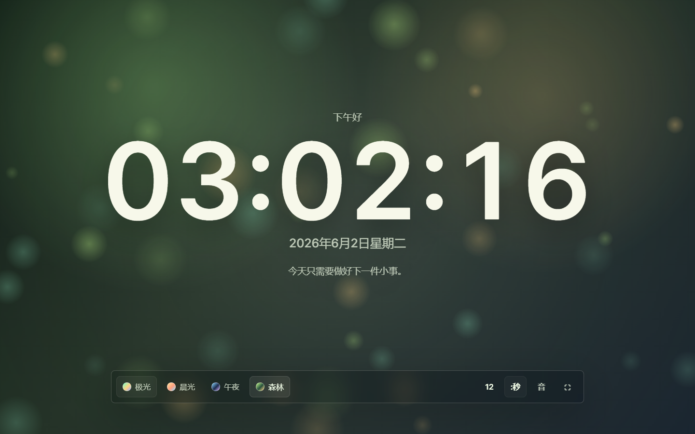

# Ambient Desk Clock

一个轻量的桌面氛围时钟，适合全屏放在副屏或桌面窗口里使用。它不依赖构建工具和网络资源，克隆后直接打开 `index.html` 即可运行。



## 功能

- 实时时钟，支持 12/24 小时制
- 可显示或隐藏秒数
- 四套氛围主题：极光、晨光、午夜、森林
- Canvas 动态粒子背景
- 每日一句专注提示
- 全屏按钮
- 可手动开启的轻量氛围音
- 设置会保存在 LocalStorage

## 使用方式

直接双击 `index.html`，或用任意静态服务器打开：

```bash
npx serve .
```
